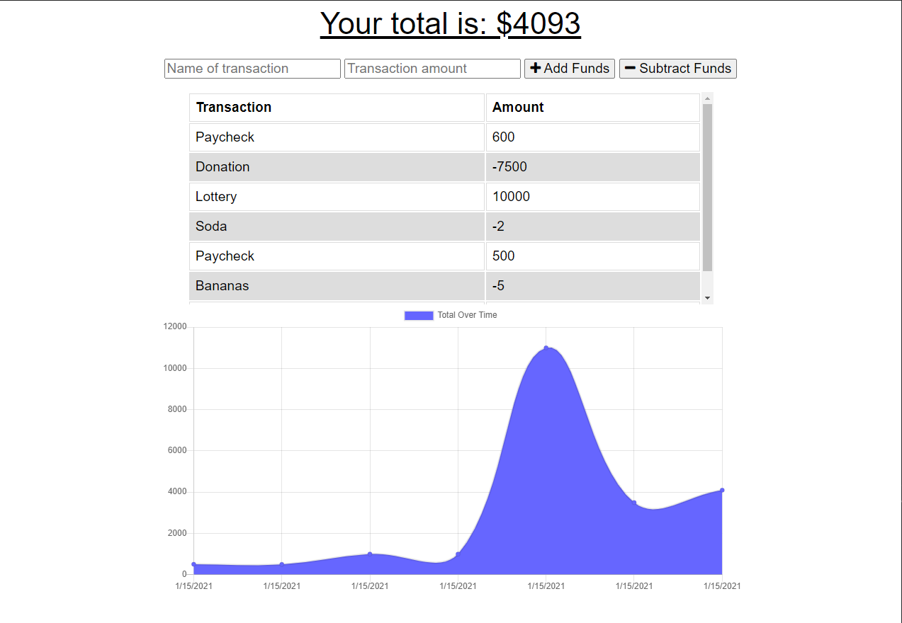
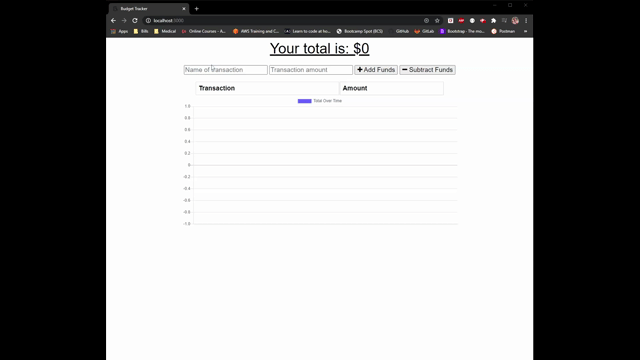

# Budget-Tracker

## Description

This is an application allows user to track budget by adding transactions based on their expenses and deposits. This application allows user to continue entering transactions offline and then syncing those transactions once the application is brought back online.

This application can also be downloaded to the user's device and continue to function without the need for a web browser.

- [Description](#description)
- [User Story](#user-story)
- [Acceptance Criteria](#acceptance-criteria)
- [Application Screenshot](#application-screenshot)
- [Technologies](#technologies)
- [Installation](#installation)
- [Usage](#usage)

## User Story

AS AN avid traveller
I WANT to be able to track my withdrawals and deposits with or without a data/internet connection
SO THAT my account balance is accurate when I am traveling

## Acceptance Criteria

GIVEN a user is on Budget App without an internet connection
WHEN the user inputs a withdrawal or deposit
THEN that will be shown on the page, and added to their transaction history when their connection is back online.

## Application Screenshot

_Main application page screenshot with sample transactions_

## Technologies

The following packages/technologies were used in the creation of this application.

- MongoDB
- Mongoose
- MongoDB Atlas
- Express
- Heroku
- IndexDB

## Installation

There is no installation required for this application as it is hosted on a Heroku server. This is the link to the [Budget Tracker](https://mighty-eyrie-92459.herokuapp.com/).

To view the project files please visit my [GitHub Repository](https://github.com/ntch2000/budget-tracker).

## Usage

To utilize this application, go to the application link provided to view the main page. This page will have a list of recent transactions and a graph of those transactions. Users can enter a transaction and click either "Add Funds" or "Subtract Funds" to indicate a deposit or withdraw. These transactions will then be added to the database and graph accordingly.

This application can also work offline. If the application looses connectivity, transactions will be added to the IndexDB "pending" database. Once connectivity is restored, the transactions will be added to the MONGODB database.

Finally, because this is a Progressive Web Application (PWA), the application can be downloaded to the user's device. This will allow the user to run the application without the need to utilize their browser.

_Gif of using the Budget Tracker application_

---

© 2021 Neil Gandhi
